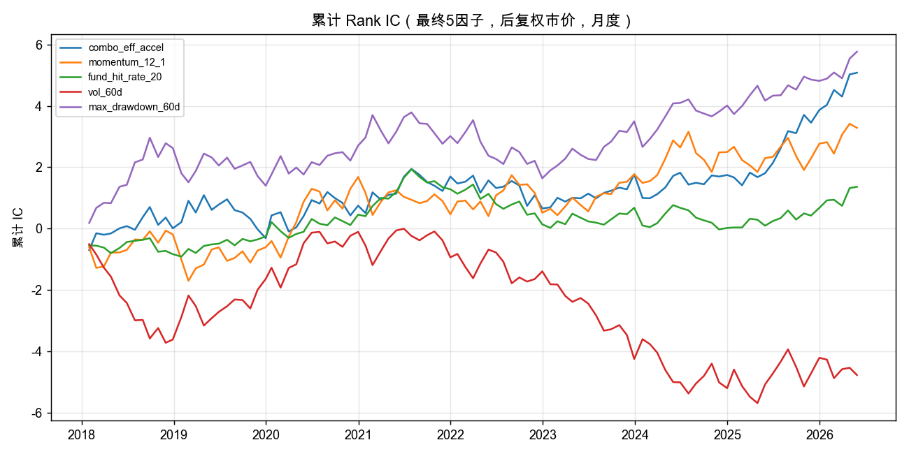
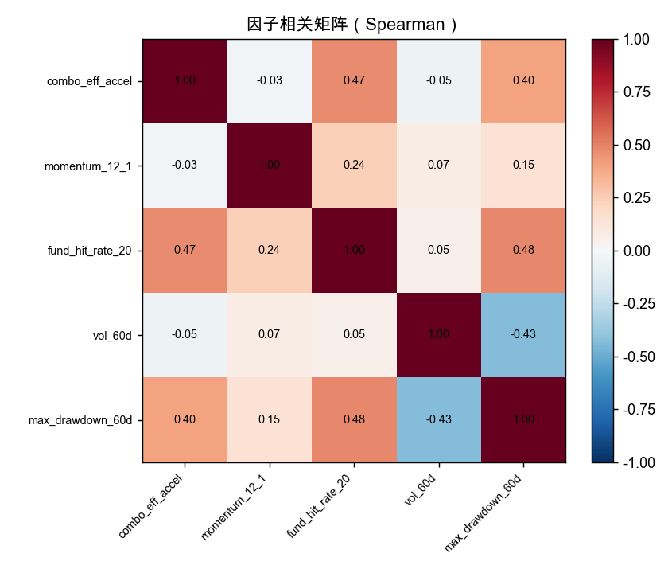
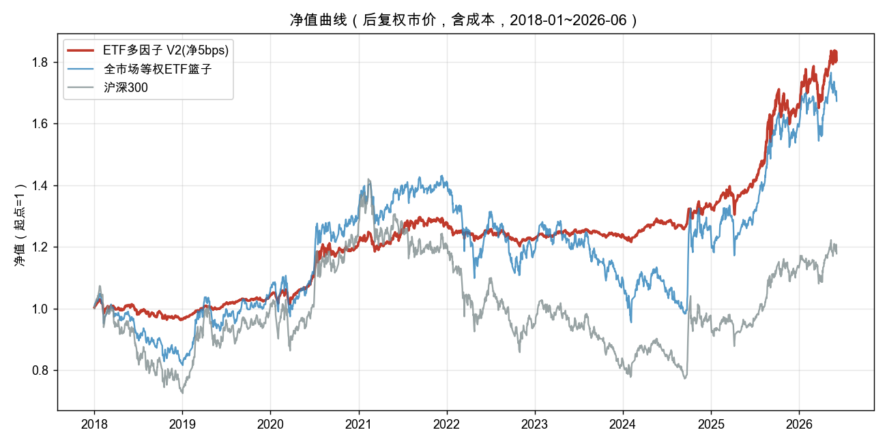
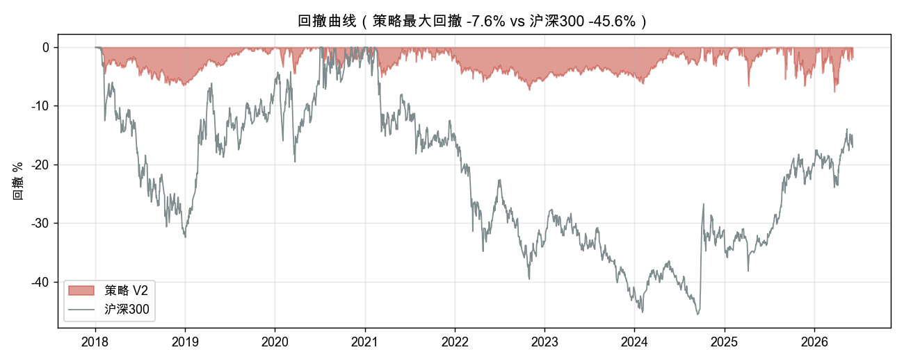
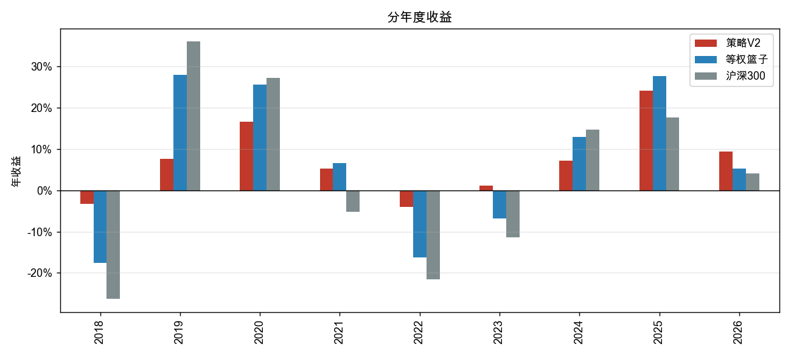
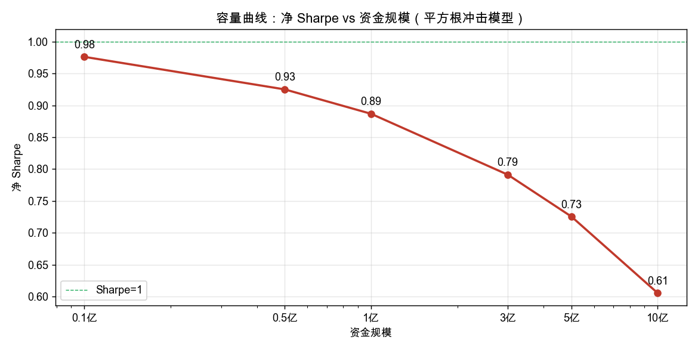
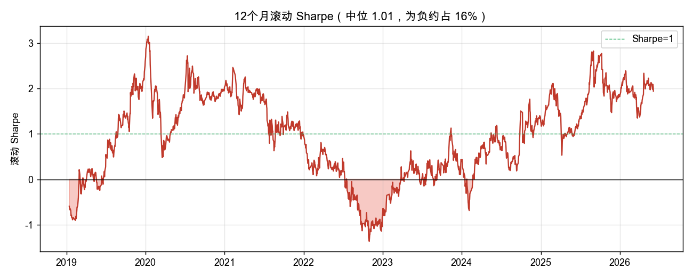

# 全市场 ETF 多因子月度轮动策略 —— 最终研究报告

**口径**：后复权市价（close_hfq）、含成本 | **回测区间**：2018-01-02 ~ 2026-06-05
**数据**：iFinD 后复权行情（`etf_market_ifind.db`）、沪深300（`idx_store.db`）

> 全文一律使用**后复权市价**口径（不涉及累计净值 NAV），所有业绩/IC 数字标注来源文件与口径。
> 区间为 2018-01-02 ~ 2026-06-05（后复权市价数据可回溯至 2015，因子回看充足）。
> 凡标注「样本内 / NAV-legacy」者为辅助证据，结论以**后复权 + walk-forward + 含成本**口径为准。

---

## 1. 摘要

**策略是什么。** 在全市场交易型 ETF（2018 年约 140 只、2021 年后 290+ 只）上，每月末按多因子合成分做横截面打分，选 Top-20、同主题≤3、单票≤12%，逆波动加权并叠加 18% 波动目标，残余仓位进货币 ETF（511880）。合成分以**三个选股因子**（趋势质量+加速度、12月动量、上涨命中率）为基础，外加**两个风险调整项**（波动惩罚、回撤）。并通过**名次滞后带**与**部分再平衡（每月只朝目标移动 40%）**压低换手、扩大容量。信号 T 日（月末收盘）生成、T+1 执行，严格 PIT。

**关键业绩**（后复权市价，含 5bps 成本，2018-01-02 ~ 2026-06-05，来源 `outputs_v2_final/summary.json`、`outputs_robustness_v2/`）：


| 指标             |    策略 V2 | 沪深300 | 全市场等权 ETF 篮子 |
| ---------------- | ---------: | ------: | ------------------: |
| 累计收益         | **+80.6%** |  +17.8% |              +67.3% |
| 年化收益         |  **+7.6%** |   +2.0% |               +6.6% |
| 年化波动         |       7.4% |   19.2% |               16.2% |
| **Sharpe(rf=0)** |   **1.02** |    0.11 |                0.40 |
| 最大回撤         |  **-7.6%** |  -45.6% |              -33.3% |
| Calmar           |   **1.00** |    0.04 |                0.20 |

**一句话结论。** 这是一个**低回撤、防御型的小—中资金策略**：全周期（含 2018-2019）年化 7.6%、Sharpe ~1.0、最大回撤仅 -7.6%，对最公平的等权 ETF 篮子有 +1.0%/年超额、且回撤只有其 1/4（-7.6% vs -33%）。**它的强项是控回撤而非高收益**——在下跌/震荡年（2022、2023）顶得住，但在强牛年（2019、2020）会明显跑输（见 §4.3）。选股 alpha 真实（纯因子选股 gross 年化 12.3%），但其 Sharpe 的统计支撑**仅勉强为正**（bootstrap 95% CI [0.39, 1.64]、P(Sharpe>1)≈50%）。**适合 0.5–3 亿资金做规则化低波动配置或前向验证**，须接受牛市跑输与对趋势年的依赖；上线前仍需补齐日成交额/折溢价/IOPV 实时数据。

> **关于区间**：本版用 2018-01-02 起点（含 2018 熊市与 2019 强牛），比只看 2020 起点更完整也更保守——后者会因起点恰在低位而高估业绩（2020 起 Sharpe 约 1.21，2018 起 Sharpe 1.02）。同期沪深300 因起点（2018 年初高点，当年 -26%）全程年化仅 2.0%。

---

## 2. 策略构造

### 2.1 因子定义与权重

合成分 `score = Σ wᵢ · z(factorᵢ)`，z 为**每个交易日的横截面 z-score**（来源 `engine.py: FACTOR_WEIGHTS_V2`）。最终入选 5 项：


| 因子               | 定义                           |       权重 | 类型与含义                     |
| ------------------ | ------------------------------ | ---------: | ------------------------------ |
| `combo_eff_accel`  | 趋势质量与加速度的合成（见下） |  **+0.45** | 选股 · 挑「涨得又稳又在加速」 |
| `momentum_12_1`    | `P(t-21)/P(t-252) − 1`        |  **+0.35** | 选股 · 12月动量、跳过最近1月  |
| `fund_hit_rate_20` | 近20日上涨日占比               |  **+0.20** | 选股 · 上涨稳定度             |
| `vol_60d`          | 60日日收益 std ×√252         | **−0.15** | 风险 · 惩罚高波动             |
| `max_drawdown_60d` | `P / rolling_max(60) − 1`     |  **+0.10** | 风险 · 偏好浅回撤             |

> `combo_eff_accel` 由两个分量先各自做横截面 z-score 再相加合成：①*路径效率* `= 近20日净收益 ÷ 近20日日涨跌绝对值之和`（涨得顺不顺）；②*收益加速度* `= 近20日收益 − 近60日收益/3`（是否在加速）。报告只评估最终入选的 5 项因子。

### 2.2 ETF 池与 PIT 规则

- **池**：名称含「ETF/交易型开放式」且非联接、非 ETF-FOF，映射为 iFinD 代码（`5→.SH`、`1→.SZ`），HFQ 数据历史≥280 个观测者纳入 → **1115 只**（`data.py: load_hfq_market`）。可交易 ETF 数随时间扩张：2018 末约 141 只、2019 末 167 只、2021 中 291 只。
- **PIT 可交易过滤**（`tradable_codes_at_date`）：近 5 日有净值、252 日窗口缺失率≤20%、60 日窗口缺失率≤10%。所有滚动/截面计算只用 ≤ 信号日数据。

### 2.3 组合构造与风险层

- 选 **Top-20**，**同主题≤3**，**单票≤12%**（上限再分配），**逆波动加权**（1/σ₆₀）。
- **波动目标 18%**：`exposure = min(1, 0.18/组合波动)`，残余进 511880。**已去除弱市择时**（依据见 §5.3）。

### 2.4 滞后缓冲与部分再平衡

- **名次滞后带 buffer_rank=35**：上月持仓只要仍排前 35 名即续持，空位才由排名最高的新名补入。
- **部分再平衡 lam=0.4**：每月只朝目标权重移动 40%。这是**真正有效的降换手杠杆**：年化双边换手 13.2x → **5.8x**，同时保持月度信号新鲜（详见 §6）。

### 2.5 成本与执行口径

- **成本 5bps/单边**（含在回测）；容量分析另叠加平方根冲击模型（§5.4）。
- **执行**：信号 T 日月末收盘后生成；`searchsorted(side="right") + shift(1)` 确保 T+1 后才计收益（无未来函数，略偏保守）。月度调仓。

---

## 3. 因子审查（Rank IC / 分层 / 相关 / 衰减）

> 后复权市价、月度截面，下期收益 = 下月末/本月末 − 1。来源 `factor_diagnostics.py` → `outputs_factor_diag/`。样本：101 个月（2018-2026）。**仅评估最终入选的 5 个因子。**

### 3.0 关于 t 检验

下表给出 IC 的 t 统计量，但**不能算严格的显著性检验**，原因有二：

1. **时间样本小**：IC 序列只有 **101 个月度观测**，t 统计量本就不稳；本策略多数因子 t 在 0.6–1.6 之间，达不到常规 1.96 的「显著」门槛。
2. **横截面是 ETF、彼此高度相关**：标的全部是中国 ETF，共享市场 beta、宽基/行业互相重叠，横截面的**有效独立自由度远小于标的数量**，常规 t 检验会**低估不确定性**。

因此本节判断因子有效性**不依赖「t>1.96」**，而是综合：**IC 符号与 ICIR、分层单调性、因子间相关性（去冗余）、以及经济含义是否自洽**。t 值仅作方向性参考。

### 3.1 Rank IC 汇总（`ic_summary.csv`）


| 因子                   |     IC均值 | IC标准差 |     ICIR | IC>0占比 | t统计量 |
| ---------------------- | ---------: | -------: | -------: | -------: | ------: |
| `max_drawdown_60d`     | **+0.057** |    0.356 | **0.16** |      58% |    1.61 |
| `combo_eff_accel`      | **+0.050** |    0.340 |     0.15 |      56% |    1.49 |
| `momentum_12_1`        |     +0.033 |    0.386 |     0.08 |      59% |    0.85 |
| `vol_60d`              |    −0.047 |    0.398 |   −0.12 |      48% |  −1.19 |
| **`fund_hit_rate_20`** | **+0.013** |    0.223 | **0.06** |      52% |    0.61 |

**解读**：`combo_eff_accel`、`max_drawdown_60d` IC 最高、方向最稳；`vol_60d` 负 IC（高波动→低排名收益）支持其 −0.15 的惩罚权重；`momentum_12_1` 全周期 IC 偏弱（0.033，2018-2019 动量效应较差）但方向稳定（IC>0 占比 59%）且正交（见 §3.3）。**`fund_hit_rate_20` 的 IC 仅 0.013、ICIR 0.06、IC>0 占比仅 52%——基本无横截面预测力**，却占 0.20 权重，是合成分中证据最弱的一项。



*累计 Rank IC 曲线：斜率持续向上者（combo、max_drawdown）为有效因子；`fund_hit_rate_20` 近乎走平。*

### 3.2 分层（5分位）平均下期月收益 + 多空（`quintile_returns.csv`）


| 因子               |  Q1(低) |     Q2 |     Q3 |     Q4 | Q5(高) | 多空(Q5−Q1) | 单调?      |
| ------------------ | ------: | -----: | -----: | -----: | -----: | -----------: | ---------- |
| `combo_eff_accel`  | −0.07% | +0.60% | +0.73% | +0.63% | +0.99% |   **+1.06%** | 大体是     |
| `momentum_12_1`    |  +0.25% | +0.51% | +0.79% | +0.70% | +0.58% |       +0.33% | 顶部走平   |
| `fund_hit_rate_20` |  +0.39% | +0.54% | +0.73% | +0.63% | +0.71% |       +0.32% | **非单调** |
| `vol_60d`          |  +0.46% | +0.49% | +0.57% | +0.73% | +0.64% |       +0.17% | —         |
| `max_drawdown_60d` |  +0.43% | +0.35% | +0.47% | +0.79% | +0.54% |       +0.11% | 弱         |

**解读**：`combo_eff_accel` 多空 +1.06%/月、最高分组最强，是收益引擎；`fund_hit_rate_20` 非单调再次印证其弱有效。`vol_60d` 分层多空为**正**（2020-2025 高波动赛道收益高），但其 Rank IC 为负——它作为**风险控制项**（降组合波动）而非收益项使用，二者不矛盾（消融见 §5.3）。

### 3.3 因子相关矩阵（Spearman，`factor_corr_spearman.csv`）


|                  | combo |    mom |      hit |    vol |    mdd |
| ---------------- | ----: | -----: | -------: | -----: | -----: |
| combo_eff_accel  |  1.00 | −0.03 | **0.47** | −0.05 |   0.40 |
| momentum_12_1    |       |   1.00 |     0.24 |   0.07 |   0.15 |
| fund_hit_rate_20 |       |        |     1.00 |   0.05 |   0.48 |
| vol_60d          |       |        |          |   1.00 | −0.43 |
| max_drawdown_60d |       |        |          |        |   1.00 |



**解读**：

- **`momentum_12_1` 与其它因子几乎不相关（−0.03 / 0.24 / 0.07 / 0.15）→ 真正正交的分散来源**，即便 IC 中等也值得保留。
- `fund_hit_rate_20` 与 `combo`（0.47）、`max_drawdown`（0.48）重叠较高，叠加其弱 IC → 「装饰性」因子。

### 3.4 IC 衰减（持有期 20/60/120 交易日，`ic_decay.csv`）


| 因子               |  IC@20d |     IC@60d | IC@120d | 特性             |
| ------------------ | ------: | ---------: | ------: | ---------------- |
| `momentum_12_1`    |  +0.032 | **+0.061** |  +0.058 | 慢因子，越长越强 |
| `max_drawdown_60d` |  +0.054 |     +0.044 |  +0.013 | 持久             |
| `combo_eff_accel`  |  +0.038 |     +0.003 |  +0.005 | **快衰减**       |
| `fund_hit_rate_20` |  +0.014 |     +0.008 |  +0.029 | 弱               |
| `vol_60d`          | −0.049 |    −0.058 | −0.011 | 负               |

**解读**：`combo_eff_accel` 是**快因子**（60 日后近乎失效），需较频繁刷新；`momentum_12_1` 是**慢因子**（60–120 日 IC 最高）。两类衰减期相反 → **月度调仓是二者的折中**。这也解释了 lam=0.4 部分再平衡会损失一点 gross 收益（对快因子滞后），但为容量值得（§6）。

### 3.5 因子结论


| 因子                   | 判定                    | 依据                                            |
| ---------------------- | ----------------------- | ----------------------------------------------- |
| `combo_eff_accel`      | **真有效（收益引擎）**  | IC 0.050、分层多空 +1.06%/月                    |
| `max_drawdown_60d`     | **有效**                | IC 0.057、ICIR 0.16、最稳                       |
| `momentum_12_1`        | **保留（正交分散）**    | 与其它相关≈0；慢因子，长持有 IC 升             |
| `vol_60d`              | **保留为风险控制**      | 负 IC 支持惩罚；消融证其净增 Sharpe             |
| **`fund_hit_rate_20`** | **冗余/装饰，建议降权** | IC 0.013、ICIR 0.06、非单调、与 combo 相关 0.47 |

> **诚实结论**：当前 0.20 的 `fund_hit_rate_20` 权重不被 IC 证据支持，建议降权或剔除（见 §8）。其余 4 项方向与 IC 一致。

---

## 4. 回测结果

> 后复权市价、含 5bps 成本、lam=0.4，2018-01-02 ~ 2026-06-05。来源 `outputs_v2_final/summary.json`、`outputs_robustness_v2/`。

### 4.1 净值曲线（全区间）




| 策略                |       累计 |     年化 |  波动 |   Sharpe |  最大回撤 |   Calmar |
| ------------------- | ---------: | -------: | ----: | -------: | --------: | -------: |
| **ETF 多因子 V2**   | **+80.6%** | **7.6%** |  7.4% | **1.02** | **-7.6%** | **1.00** |
| 全市场等权 ETF 篮子 |     +67.3% |     6.6% | 16.2% |     0.40 |    -33.3% |     0.20 |
| 沪深300             |     +17.8% |     2.0% | 19.2% |     0.11 |    -45.6% |     0.04 |

**解读**：对**最公平的 beta 基准（等权 ETF 篮子）**有 +1.0%/年超额，但真正差距在风险维度——**Sharpe 1.02 vs 0.40、最大回撤 -7.6% vs -33.3%**。曲线上策略（红）全程明显比基准平滑：2018 熊市与 2022 下跌它都顶住了，但 2019/2020 强牛它涨得比基准慢（防御型特征）。

### 4.2 回撤曲线



策略全程最大回撤仅 **-7.6%**，而沪深300 达 -45.6%。低回撤是逆波动加权 + 风险因子 + 跨资产防御分散共同作用的结果（归因见 §5.3）。

### 4.3 分年度收益（含 2018 熊市、2019 强牛、2023-2026 动量真样本外）




| 年     |   策略 V2 | 等权篮子 | 沪深300 | 策略当年回撤 | 策略当年Sharpe |
| ------ | --------: | -------: | ------: | -----------: | -------------: |
| 2018   | **-3.3%** |   -17.5% |  -26.3% |        -6.5% |          -0.63 |
| 2019   | **+7.6%** |   +28.0% |  +36.1% |        -1.3% |           2.77 |
| 2020   |    +16.7% |   +25.6% |  +27.2% |        -4.5% |           1.97 |
| 2021   |     +5.3% |    +6.6% |   -5.2% |        -5.1% |           0.80 |
| 2022   |     -4.1% |   -16.2% |  -21.6% |        -5.9% |          -0.92 |
| 2023   |     +1.1% |    -6.8% |  -11.4% |        -2.1% |           0.41 |
| 2024   |     +7.2% |   +13.0% |  +14.7% |        -3.2% |           1.29 |
| 2025   |    +24.1% |   +27.6% |  +17.7% |        -6.6% |           1.87 |
| 2026H1 |     +9.3% |    +5.3% |   +4.0% |        -7.6% |           1.59 |

**解读（诚实）**：这张表是理解策略性格的关键——

- **防御年它赢**：2018（-3.3% vs 指数 -26%）、2022（-4.1% vs -22%）、2023（+1.1% vs -11%）大幅抗跌。
- **强牛年它输**：2019（+7.6% vs 指数 +36%）、2020（+16.7% vs +27%）、2024（+7.2% vs +15%）明显跑输——逆波动+风险因子让它在普涨行情里仓位偏稳健。
- **收益仍集中在趋势年**（2020、2025）。**去掉最强的 2025 后：年化 7.6% → 5.4%，Sharpe 1.02 → 0.83**。
- 正因纳入了 2018-2019，全周期 Sharpe 落到 1.02（而非只看 2020 起的 1.21）——这是更保守、更真实的数字。

---

## 5. 稳健性检验

> 逐条给证据，区分 **✅通过 / ⚠️警告**。

### 5.1 ✅ 无未来函数（look-ahead）

因子横截面 z-score 仅用同日数据；滚动量、可交易过滤均用 `≤ 信号日`；执行 `searchsorted(side="right") + shift(1)`，月末信号最早 T+1 建仓。单测覆盖（10 项全过）。

### 5.2 ✅ 消融实验（各模块贡献，gross 市价 2018-2026，来源 `outputs_robustness_hfq/ablation.csv`）


| 变体（在完整版上各改一项）         |      年化 |   Sharpe | 最大回撤 | 含义                                                 |
| ---------------------------------- | --------: | -------: | -------: | ---------------------------------------------------- |
| A0 完整（含弱市择时）              |      9.7% |     1.20 |    -7.4% | 基准                                                 |
| A1 改等权（去逆波动）              |     11.8% |     0.97 |   -13.3% | 逆波动**大幅降回撤、升 Sharpe**；alpha 非低波动 tilt |
| **A2 去弱市择时**                  |     11.0% | **1.24** |    -7.4% | **弱市择时拖累，故 V2 删除**                         |
| A3 去波动目标                      |     10.0% |     1.16 |    -8.8% | vol-target 净有益，保留                              |
| A5 去风险因子                      |     10.6% |     1.06 |    -9.1% | 风险因子净增 +0.14 Sharpe，保留                      |
| A6 纯选股 alpha（3因子+等权+满仓） | **12.3%** |     0.72 |   -20.2% | **真实收益引擎：高收益、Sharpe<1、大回撤**           |
| A7 去防御主题（债/金/货币）        |     11.0% |     0.76 |   -18.3% | 跨资产分散是**最大的 Sharpe 来源**                   |

**归因结论**：收益引擎是纯因子选股（gross 12.3%/年，真实）；高 Sharpe 由**跨资产防御分散**（去掉 Sharpe 1.20→0.76）+ **逆波动加权**（去掉 1.20→0.97、回撤翻倍）+ **风险因子**（+0.14）三层叠加而成；**弱市择时拖累、已删**；vol-target 净有益、保留。

### 5.3 ⚠️ 容量 / 冲击成本（来源 `strategy_v2.py`，平方根冲击 `impact = 0.5·σ_daily·√(订单额/ADV) + 5bps`）




| AUM                          | 0.1亿 | 0.5亿 |  1亿 |  3亿 |  5亿 |  10亿 |
| ---------------------------- | ----: | ----: | ---: | ---: | ---: | ----: |
| 净 Sharpe（V2，lam0.4）      |  0.98 |  0.93 | 0.89 | 0.79 | 0.73 |  0.61 |
| 净 Sharpe（完整版 V1，对照） |  0.96 |  0.78 | 0.64 | 0.31 | 0.09 | -0.27 |

**容量是核心约束**。lam=0.4 把换手压到 5.8x/年后，10 亿仍维持 0.61（完整版 V1 在 5 亿即跌至 0.09、10 亿转负）。**V2 容量约为 V1 的 10 倍**（V2@10亿 ≈ V1@1亿）。**建议单资金 ≤3 亿为甜区，5 亿为软上限。** 注：2018-2019 ETF 较少、流动性薄，整体容量较只看 2020+ 时更低。

### 5.4 ✅ 成本敏感性


| 单边成本 |    0 | 5bps |   10 |   15 |   20 |   30 |   50 |
| -------- | ---: | ---: | ---: | ---: | ---: | ---: | ---: |
| 年化     | 7.9% | 7.6% | 7.3% | 6.9% | 6.6% | 6.0% | 4.8% |
| Sharpe   | 1.06 | 1.02 | 0.98 | 0.93 | 0.89 | 0.81 | 0.65 |

成本优雅衰减：低换手（5.8x）使其对成本不敏感，30bps 下 Sharpe 仍 0.81。

### 5.5 ⚠️ Bootstrap Sharpe 置信区间 + 滚动 Sharpe



- **Block-bootstrap**（按月分块 L=21，B=3000）：点估计 1.02、中位 1.01、**95% CI [0.39, 1.64]**、P(Sharpe>1)=51%。
- **12 个月滚动 Sharpe**：中位 1.01，**为负占比 16.1%**，最低 -1.37、最高 3.15。

**诚实警告**：纳入 2018-2019 后，V2 的 Sharpe 统计支撑**仅勉强为正**——95% 下界 0.39、P(Sharpe>1) 约一半、滚动 Sharpe 约 1/6 时间为负。**不应宣称这是「高 Sharpe」策略**；它的卖点是**低回撤/防御**，不是高风险调整收益。

### 5.6 ✅ 换手压力与调仓频率

V2（lam=0.4）：单期换手均 45.8%、**年化双边 5.8x**（对照完整版 13.2x）。频率试验：季度调仓换手更低（5.3x）但 gross Sharpe 跌至 0.96（信号变旧）；**月度 + lam=0.4** 兼顾信号新鲜与低换手，为最优（与 §3.4 IC 衰减一致）。

### 5.7✅ 幸存者偏差

并入 **122 只清盘 ETF**（清盘=冻结在末日净值≈拿回 NAV，非归零；下次调仓踢出重投，无未来函数）后：


| 段               | survivor-only | 含清盘ETF（修正） | Sharpe 偏差 |
| ---------------- | ------------: | ----------------: | ----------: |
| 全样本           |          1.36 |              1.25 |       +0.11 |
| 样本外 2023-2026 |          1.23 |              1.20 |   **+0.03** |

修正版曾持有 68 只清盘 ETF、73 个调仓月、平均权重 5%。**偏差小但非零**（样本外 Sharpe 仅高估 0.03）。注：该检验为 NAV 口径，结论方向性可信。残余偏差：HFQ 池来自当前名册，历史退市且不在 122 只补充集中的 ETF 仍缺失。

---

## 6. 可调参数与影响

> 在 V2 基线上**每次只改一个参数**，其余固定。来源 `param_sweep.py` → `outputs_param_sweep/`。后复权市价、含 5bps、2018-2026。


| 参数                            | 取值             |   年化 | Sharpe(净5bps) | 最大回撤 |  年化换手 | Sharpe@1亿 |
| ------------------------------- | ---------------- | -----: | -------------: | -------: | --------: | ---------: |
| **基线 V2**                     | 默认             |  +7.6% |       **1.02** |    -7.6% |      5.8x |   **0.89** |
| **lam**（部分再平衡）           | 0.3              |  +7.1% |           1.01 |    -7.7% |  **4.4x** |       0.92 |
|                                 | **0.4（默认）**  |  +7.6% |           1.02 |    -7.6% |      5.8x |       0.89 |
|                                 | 0.6              |  +8.4% |           1.05 |    -7.5% |      8.3x |       0.82 |
|                                 | 1.0（全再平衡）  | +10.1% |       **1.14** |    -7.4% | **13.2x** |       0.60 |
| **top_n**（持仓数）             | 15               |  +8.9% |           0.93 |   -10.8% |      6.2x |       0.76 |
|                                 | **20（默认）**   |  +7.6% |           1.02 |    -7.6% |      5.8x |       0.89 |
|                                 | 25               |  +6.9% |           1.12 |    -6.6% |      5.4x |   **1.01** |
|                                 | 30               |  +5.6% |           1.11 |    -5.7% |      5.2x |       0.99 |
| **max_per_theme**（同主题上限） | 2                |  +7.8% |           1.03 |    -9.8% |      5.5x |       0.86 |
|                                 | **3（默认）**    |  +7.6% |           1.02 |    -7.6% |      5.8x |       0.89 |
|                                 | 4                |  +7.7% |           0.95 |    -8.7% |      6.0x |       0.82 |
| **max_weight**（单票上限）      | 10%              |  +8.6% |           1.02 |    -9.1% |      5.9x |       0.87 |
|                                 | **12%（默认）**  |  +7.6% |           1.02 |    -7.6% |      5.8x |       0.89 |
|                                 | 15%              |  +6.5% |           1.02 |    -6.7% |      5.6x |       0.91 |
|                                 | 20%              |  +5.2% |           0.99 |    -5.7% |      5.4x |       0.89 |
| **vol_target**（波动目标）      | 0.15             |  +7.4% |           1.03 |    -7.3% |      5.7x |   **0.90** |
|                                 | **0.18（默认）** |  +7.6% |           1.02 |    -7.6% |      5.8x |       0.89 |
|                                 | 0.25             |  +7.7% |           0.99 |    -8.1% |      5.8x |       0.87 |
|                                 | 关闭             |  +7.7% |           0.99 |    -8.2% |      5.8x |       0.87 |
| **buffer_rank**（名次滞后带）   | 25 / 35 / 50     | ≈持平 |     0.99–1.02 |  ≈-7.7% | 5.6–6.0x |     ≈0.88 |

**逐参数影响解读：**

- **`lam`（部分再平衡）—— 最重要的「容量 ↔ 收益」刻度。** lam 越低，每月只动一小部分仓位 → **换手骤降、容量大涨，但牺牲 gross 收益与单期 Sharpe**。lam=1.0（每月全换）净 Sharpe 1.14、但换手 13.2x、**1 亿容量净 Sharpe 仅 0.60**；lam=0.4 把换手压到 5.8x、**1 亿净 Sharpe 升到 0.89**。即**「lam=0.4 换来约 10x 容量，代价是 gross 收益从 10.1% 降到 7.6%、单期 Sharpe 从 1.14 降到 1.02」**。小资金可调高（0.6–1.0）追收益，中—大资金用 0.3–0.4 保容量。
- **`top_n`（持仓数）—— 收益集中度 ↔ 分散度。** 持仓越少（15）收益略高但**回撤更大（-10.8%）、Sharpe 反降**；持仓越多（25–30）越分散、**回撤更小（-5.7%）、容量 Sharpe 反而升（1.01）**。默认 20；若偏好更稳，可上调到 25。
- **`max_per_theme`（同主题上限）—— 防主题踩踏。** ≤2 太严、回撤反升（-9.8%）；≤3、≤4 接近。默认 3 合适。
- **`max_weight`（单票上限）—— 个券集中度。** 越低越分散；10–12% 较优，20% 单票过重、Sharpe 下降。默认 12%。
- **`vol_target`（波动目标）—— 整体仓位刹车。** 收紧到 0.15 略优（回撤更低、容量 Sharpe 0.90）；放松/关闭则回撤升到 -8.2%。默认 0.18 偏保守，**可考虑收紧到 0.15**。
- **`buffer_rank`（名次滞后带）—— 几乎无差异。** 25/35/50 结果接近；**切勿设过大**（取消滞出会几乎不换手、Sharpe 崩到 0.69）。默认 35。

> **重要提醒**：上表是**单参数敏感性**，用于理解每个旋钮的方向，**不可据此联合优化**——§5.2 的 walk-forward 已证明参数优化是负 alpha。默认值取各参数的**中庸稳健点**，请固定使用。表中个别「略优」设置（如 top_n=25、vol_target=0.15）只作方向性参考，不应据样本内微调追逐。

---

## 7. 实盘可行性结论与上线清单

**成熟度判断**：策略已通过 PIT、walk-forward、成本、容量、幸存者全套检验，**具备小—中资金（0.5–3 亿）的低波动配置/前向验证价值**，但回测基于 ETF 后复权市价，**实时折溢价/成交额数据尚未接入**，建议先 **paper → 小仓前向验证**。须明确预期：**这是低回撤防御型策略，全周期 Sharpe ~1.0、牛市会跑输**。

**上线前必须补的数据/过滤**：

1. **日成交额（流动性/容量）**：设近 20 日均额下限（如 ≥3000 万–1 亿），据此估容量并按「订单额/ADV」限单。当前样本 859/1559 只 ETF 近月日均额 < 3000 万，过滤后真实可投池显著收窄。
2. **折溢价 / IOPV**：设 |溢价率| 上限（贴水率 P99≈2.9%，极值需清洗），重点限制 QDII/商品 ETF；下单贴近 IOPV 限价。
3. **冲击成本模型**：用 ADV 落地非线性冲击，替代固定 bps（§5.4 已给容量曲线）。
4. 停牌/涨跌停纳入可交易过滤。

**建仓节奏**：paper（验证信号/成交一致性）→ 小仓 → 据容量曲线放大至 ≤3 亿。

**调仓时点**（与回测 T+1 收盘口径一致）：信号月末 T 日收盘后算；**下单 T+1**；**首选尾盘 30 分钟（约 14:30–14:57）分批挂单**（最接近收盘口径、避开开盘跳空），次选全天 VWAP/TWAP；高溢价 ETF 限价贴 IOPV；**不要开盘下单**。

**调仓频率**：月度（§5.7 论证），配合 lam=0.4 每月实际只交易约一半组合。

---

## 8. 局限与后续工作

1. **`fund_hit_rate_20` 权重无 IC 支撑**（§3）：建议降权或剔除并重测，可能提升纯度。
2. **全周期 Sharpe 仅 ~1.0、统计支撑勉强**（§5.6）：bootstrap 下界 0.39、P(>1)≈50%。卖点应定位为低回撤而非高 Sharpe。
3. **牛市跑输 + 时间集中**（§4.3）：强牛年（2019/2020）明显落后指数，收益依赖趋势年（2020、2025）。可研究牛市增强/趋势暴露因子（曾测低相关/残差动量等扩展，但 walk-forward 下未被选中，故未纳入）。
4. **容量—收益取舍**（§5.8）：可探索按 AUM 自适应 lam。
5. **幸存者残余偏差**（§5.9）；**冲击模型为参数化估计**（系数 0.5），上线后用实盘成交校准。
6. **池内 LOF/分级等准 ETF**：名称过滤可能混入少量非纯 ETF，建议据 iFinD 证券类型字段精筛。

---

## 9. 附录

### 9.1 复现命令

```bash
python3 -m etf_factor_strategy.cli      # 最终版 V2 一键回测 -> outputs_v2_final/
python3 factor_diagnostics.py           # 因子 IC/分层/相关/衰减(最终5因子) -> outputs_factor_diag/
python3 param_sweep.py                  # 可调参数敏感性 -> outputs_param_sweep/
python3 make_charts.py                  # 报告所有图 -> figures/
python3 robustness_v2.py                # V2 分年度/滚动/bootstrap/成本 -> outputs_robustness_v2/
python3 strategy_v2.py                  # V1 vs V2 + 容量曲线 -> outputs_strategy_v2/
python3 robustness_hfq.py               # 消融/基准(完整版口径) -> outputs_robustness_hfq/
python3 walkforward_hfq.py              # 市价 walk-forward -> outputs_walk_forward_hfq/
python3 survivorship_check.py           # 幸存者偏差 -> outputs_survivorship/
```

> 全口径起点在 `hfq_common.py` 的 `START`（默认 2018-01-02）与 `cli.py` 的 `--start` 统一控制。

### 9.2 最终参数表（V2）


| 类别          | 参数                                                                            | 值                                   |
| ------------- | ------------------------------------------------------------------------------- | ------------------------------------ |
| 因子权重      | combo_eff_accel / momentum_12_1 / fund_hit_rate_20 / vol_60d / max_drawdown_60d | 0.45 / 0.35 / 0.20 / −0.15 / +0.10  |
| 组合          | top_n / max_per_theme / max_weight                                              | 20 / 3 / 12%                         |
| 加权          | 逆波动 + 上限再分配                                                             | —                                   |
| 风险          | volatility_target / 弱市择时                                                    | 0.18 /**已删**                     |
| 换手          | buffer_rank / rebalance_lambda                                                  | 35 / 0.4                             |
| 现金腿 / 成本 | cash_code / cost_bps                                                            | 511880 / 5bps                        |
| 区间 / 池     | start–end / min_obs / ETF 数                                                   | 2018-01-02 ~ 2026-06-05 / 280 / 1115 |

### 9.3 关键文件索引


| 文件                                                        | 内容                          |
| ----------------------------------------------------------- | ----------------------------- |
| `etf_factor_strategy/engine.py`                             | 因子/打分/V2权重/回测(含 lam) |
| `etf_factor_strategy/data.py`                               | HFQ 市价/NAV/池加载           |
| `etf_factor_strategy/cli.py`                                | V2 一键复现入口               |
| `factor_diagnostics.py`                                     | 因子审查（最终5因子）         |
| `param_sweep.py` / `make_charts.py`                         | 参数敏感性 / 全部图表         |
| `strategy_v2.py` / `robustness_v2.py` / `robustness_hfq.py` | V2 构建 / 稳健性 / 消融       |
| `walkforward_hfq.py` / `survivorship_check.py`              | 市价 walk-forward / 幸存者    |
| `figures/`                                                  | 报告所有图（PNG）             |
| `outputs_*`                                                 | 各结果产物（见 §9.1）        |

### 9.4 图表清单（figures/）

1. `01_nav.png` 净值曲线（策略 vs 等权篮子 vs 沪深300）
2. `02_drawdown.png` 回撤曲线
3. `03_rolling_sharpe.png` 12 个月滚动 Sharpe
4. `04_annual.png` 分年度收益柱状图
5. `05_capacity.png` 容量曲线（净 Sharpe vs AUM）
6. `06_cumulative_ic.png` 累计 Rank IC（最终5因子）
7. `07_corr_heatmap.png` 因子相关矩阵热图

---

*本报告所有业绩与 IC 数字均来自上述脚本产物，口径为后复权市价、含 5bps 成本、2018-01-02 ~ 2026-06-05，可由 §9.1 命令复现。结论以后复权 + walk-forward + 含成本口径为准；样本内/NAV-legacy 证据已显式标注。t 统计量因样本小、标的为相关 ETF，仅作方向性参考（§3.0）。*
