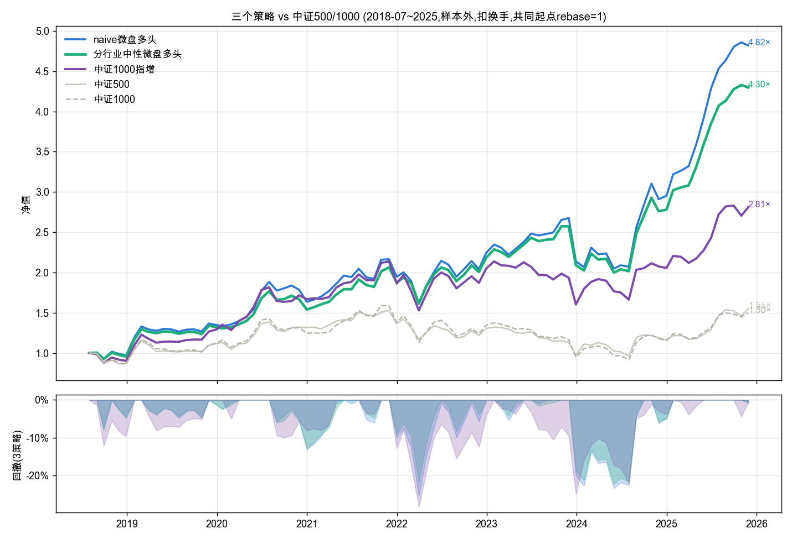

# A股多因子量化研究框架 · 作品集

> 一句话:从零搭一套 A股多因子研究流水线——挖了 **450+ 因子**、用 **LightGBM** 合成、做组合优化,最后**亲手用实验证明自己的 alpha 主体是微盘溢价、不可扩容**,诚实交付三个可复现策略。
> **这个项目的价值不在夏普,在研究规范和诚实。**

## 这个项目想证明什么
量化私募筛人看的不是"回测夏普多高"(谁都能调好看),而是四点:① **不作弊**(防前视);② **工程能力**;③ **科学方法**;④ **诚实**(知道自己数字的水分)。全项目围绕这四点。

---

## 一、整体思路(研究流水线)

```
  数据层            CSMAR(价量/财报/微观结构/另类) + iFinD(中证1000真实成分)
    │
  L0 引擎          去极值(MAD) → 中性化(市值/行业) → 标准化 → IC/ICIR/分层回测
    │              防前视测试全过(tests/test_no_lookahead.py)
    │
  因子库(450+)     价量经典 · GTJA191(182条公式解释器) · 遗传规划挖掘
    │              微观结构(订单流/VPIN/跳跃) · 基本面 · 事件 · 另类
    │
  L3 ML 合成       231因子 → LightGBM【purged & embargoed walk-forward】→ 样本外 RankIC 0.107
    │
  L4/L5 组合与优化  扣成本回测 · Barra风险模型 · cvxpy约束优化 · 市场中性 · 指数增强
    │
  诚实检验          归因纠偏 · 身份实验 · CTA自我证伪 · 抗过拟合三检验
    │
  三个最终策略      ①naive微盘多头 ②分行业中性微盘多头 ③中证1000指增
```

## 二、研究历程(思路演进 + 关键诚实发现)

| 阶段 | 做了什么 | 诚实发现 |
|---|---|---|
| 因子挖掘 | 450+公式(经典/GTJA191/遗传规划/微观/基本面/事件/另类) | **全坍缩到"流动性·反转·低波·规模"几个 premia → novelty 来自新数据不是新数学** |
| ML 合成 | LightGBM vs 岭回归 vs 等权 | **LightGBM≈岭回归 → 价值在加权不在非线性;深度学习(AlphaNet)也撞同一天花板** |
| 救回撤 | 质量筛选 / 市场中性 | 质量筛选无效(回撤是结构性beta);市场中性有效但**贴水贵(现约10%)** |
| **归因纠偏** | 换基准重做归因 | **文档里"2/3是alpha"是中证500基准的错觉;对真实小盘基准,回撤主体是 size beta** |
| **CTA 证伪** | 同期口径 + 剔除最佳月 | **"加CTA免费午餐"撤回——增益压在 2024-01 一个月上 = 过拟合** |
| **身份实验** | 同套 alpha 在各市值域重训 | **RankIC 0.107→0.056→0.030→0.002,剔掉微盘归零 = edge 是微盘溢价、不可扩容**(图04) |
| 抗过拟合定稿 | walk-forward + 敏感性 + 时间稳健 | 分行业中性是真稳健改进;CDaR 只是"用收益换回撤"的拨盘、且对指增有害 |

## 三、三个最终策略(样本外 2018-07~2025,扣换手)



| 策略 | 年化 | 夏普 | 最大回撤 | 卡玛 | 超额/IR | 定位 |
|---|---|---|---|---|---|---|
| ① naive 微盘多头 | 22.3% | 0.93 | −25.6% | 0.87 | +18%/1.10 | 收益最高 |
| ② 分行业中性微盘多头 | 20.4% | 0.91 | **−22.4%** | **0.91** | +16%/1.07 | 卡玛最高·去行业赌注 |
| ③ 中证1000指增 | 13.6% | 0.58 | −28.5%(绝对) | 0.48 | +8%/**1.18** | 可规模化·超额回撤−10% |
| 中证500 / 中证1000(基准) | 5.0/4.3% | 0.2 | −37/−43% | 0.1 | — | 反衬:同期基准几乎没涨 |

详见 [01_三个最终策略.md](01_三个最终策略.md)。

## 四、方法论亮点(作品集真正的卖点)

1. **防前视**:因子层 purged & embargoed walk-forward;4 个防前视测试全过。
2. **归因纠偏**:主动换基准,发现自己的归因被中证500 带偏了。
3. **自我证伪**:把看着漂亮的"CTA免费午餐"用剔除最佳月检验亲手推翻。
4. **身份实验**:量化"我的 alpha 是微盘溢价、不可扩容"这个不性感但真实的结论(图04)。
5. **抗过拟合纪律**:overlay 层参数一律 walk-forward + 敏感性 + 时间稳健,不 in-sample cherry-pick。

> **一个假的 IR 1.2 谁都会吹;能拿出"我做实验证明自己的 alpha 装不下大钱"的候选人,少得多。**

## 五、局限与下一步(诚实)
- **微盘策略容量受限**(装不下大钱)、**回撤 −22~26% 目前上不了实盘**——这是微盘 beta 的结构性代价,场内无干净对冲。
- **下一步**:用**杠杆/拥挤另类数据**(两融余额、微盘拥挤度、IM贴水、北向流出)做**早预警 de-risk**(微盘崩盘是杠杆强平,价量趋势反应太慢);前提是**延长历史到 2015-2016** 补够崩盘样本,否则是过拟合。

---

## 目录导航
- `README.md` —— 本文件(整个思路 + 方法)
- `01_三个最终策略.md` —— 三策略详情、构建、指标
- `最终指标.csv` —— 指标表
- `图/` —— ①三策略对比 ②微盘多头 ③中证1000指增 ④身份实验
- `脚本/` + 复现说明 —— 可复现关键脚本
- 完整代码库:上级目录 `quantlib/`(引擎)、`research/`(17+研究脚本)、`docs/`(设计文档)
